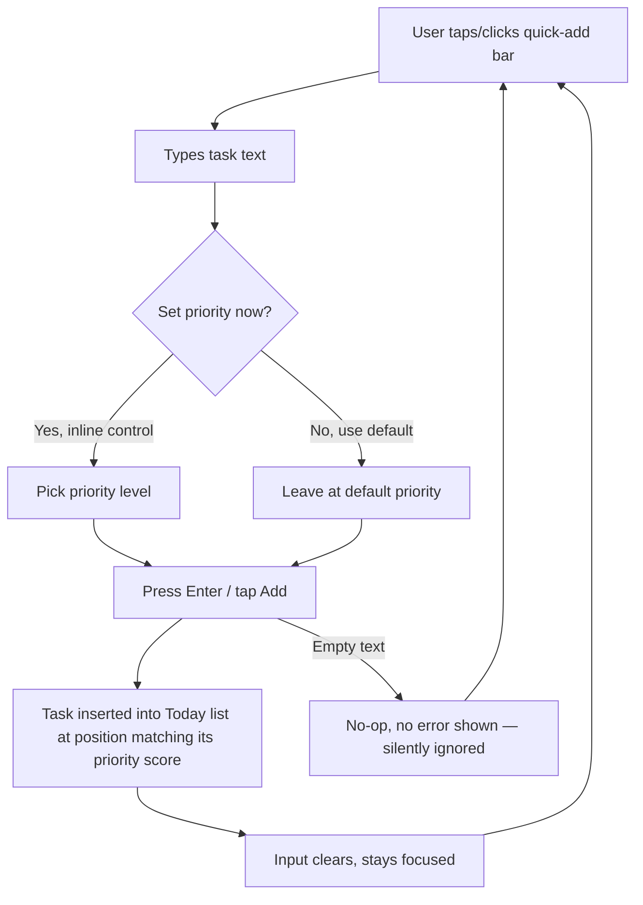
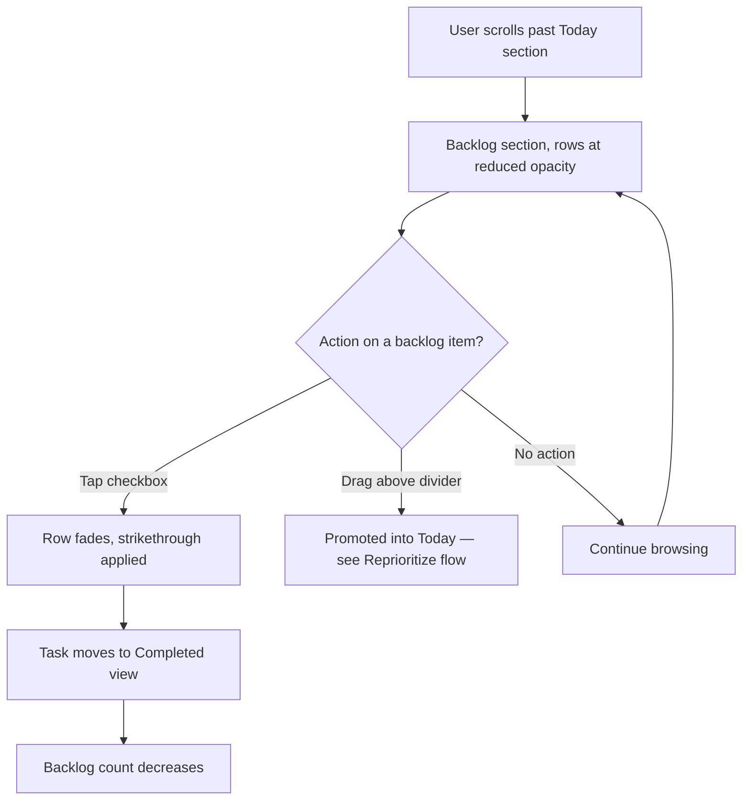

# UX Design Specification Todo

**Author:** Zeyad  
**Date:** 2026-09-21  

---

## Executive Summary

### Project Vision

A personal, dark-mode-first, minimal todo app for a single user (Zeyad) to prioritize a daily task list and review/complete a backlog. The redesign replaces a visually poor, poorly-spaced UI with a clean, considered interface built on a consistent spacing and type system.

### Target Users

Solo user — the product's only user is its own builder, a technically fluent daily user. No need to design for a broad audience or accommodate unfamiliar users; the UI can be opinionated, dense where useful, and quiet everywhere else. Used daily to plan priorities and clear a backlog.

### Key Design Challenges

- **Poor spacing/visual hierarchy** in the current UI is the core complaint — inconsistent rhythm and density undermine both usability and the "premium" feel being asked for.
- **Two distinct modes of use** — active daily prioritization vs. backlog/completed review — need to feel connected but visually distinct, without becoming two different apps.
- **Dark-mode-first legibility** — text-dense task lists, priority indicators, and category badges must stay readable and calm against a dark background, not muddy or low-contrast.
- **Minimal aesthetic vs. functional density** — drag-and-drop reordering, priority scores, categories, and due dates all need to coexist in a minimal frame without clutter.

### Design Opportunities

- Establish a strict spacing/type scale (e.g. 8pt grid) to systematically fix the spacing complaint rather than patching it visually.
- Use subtle state/color treatment (not heavy chrome or extra pages) to distinguish "today" from "backlog/completed."
- Let the existing priority-score logic drive visual weight — higher-priority tasks read as more prominent through subtle emphasis, not loud badges.
- Because this is single-user, lean into a distinct personal aesthetic (dark, minimal, quiet) rather than a safe generic default.

## Core User Experience

### Defining Experience

The core loop is **capturing a task and setting its priority** — these two actions happen most often and must feel instant, low-friction, and require minimal taps/clicks. Everything else (browsing, reviewing, completing) supports this loop rather than competing with it.

### Platform Strategy

Truly responsive, used equally on mobile and desktop — no single "primary" platform. The layout must adapt cleanly between a touch-first mobile view (bottom nav, larger tap targets) and a mouse/keyboard desktop view (sidebar, drag-and-drop), without either feeling like an afterthought.

### Effortless Interactions

- Adding a task should be reachable in one action from anywhere (no multi-step navigation to a separate "new task" screen if avoidable).
- Changing a task's priority should be a direct, low-friction interaction (e.g. drag, quick-tap control, or inline gesture) rather than opening a form to edit a field.
- Both actions should work equally well with touch (mobile) and pointer/keyboard (desktop).

### Critical Success Moments

- The moment of adding a task and setting its priority feels fast enough that it doesn't interrupt train of thought.
- Reviewing the daily list, re-prioritizing is fluid rather than fiddly — no hunting through menus.
- A make-or-break failure would be if priority-changing feels slow, hidden, or inconsistent between mobile and desktop.

### Experience Principles

1. **Capture and prioritize are first-class, always-available actions** — not buried in secondary flows.
2. **One consistent interaction model across devices** — priority-setting and task-adding should feel like the same product on phone and desktop, adapted for input method, not redesigned.
3. **Speed over ceremony** — minimal steps, minimal chrome, get out of the way of the user's thought process.
4. **Visual hierarchy communicates priority at a glance**, reducing the need to interact just to understand what matters today.

## Desired Emotional Response

### Primary Emotional Goals

Calm and focused. The app should feel quiet and controlled, not stimulating — a tool that recedes into the background of the user's thinking rather than demanding attention.

### Emotional Journey Mapping

- **Opening the app:** immediate calm — no visual noise, priorities are legible at a glance.
- **During core loop (adding/prioritizing tasks):** focused, frictionless — no hesitation about where to tap/click.
- **After completing/clearing tasks:** quiet satisfaction, not celebratory — the user simply moves on to the next thing rather than being interrupted by fanfare.
- **Returning daily:** familiarity and trust — the layout and interaction model never surprises the user.

### Micro-Emotions

- **Calm over excitement** — favor understatement; no aggressive colors, animations, or gamified feedback.
- **Confidence over confusion** — priority and status must be unambiguous at a glance.
- **Control over overwhelm** — this is the emotion to actively design against, since it's the direct failure mode of the current UI.

### Design Implications

- Cluttered/overwhelmed → strict spacing system, generous whitespace, limited simultaneous visual elements per task row.
- Calm/focused → muted dark palette, restrained color use (color reserved for priority signal, not decoration), minimal motion.
- Quiet satisfaction on completion → subtle, low-key completion state (e.g. gentle fade/strikethrough) rather than confetti or bold success banners.

### Emotional Design Principles

1. **Understatement over stimulation** — every visual element must earn its place; when in doubt, remove it.
2. **Whitespace is a feature**, directly countering the "bad spacing/clutter" complaint.
3. **Feedback should be quiet, not celebratory** — acknowledge actions without interrupting flow.
4. **Consistency breeds calm** — no surprises between sessions or devices.

## UX Pattern Analysis & Inspiration

### Inspiring Products Analysis

**Things 3** (task manager)
- Solves task capture and daily planning with an extremely calm, uncluttered visual language — generous whitespace, restrained color, soft typography.
- Navigation hierarchy (Today / Upcoming / Anytime / Someday) is simple and always legible at a glance — no learning curve.
- Completing a task has a small, satisfying but understated animation — acknowledgment without celebration.

**Linear** (issue tracker)
- Dark-mode-first by default, not a bolted-on theme — colors, contrast, and elevation are designed for dark from the ground up.
- Keyboard-first, near-instant task/issue creation (single shortcut opens capture, no modal ceremony).
- Priority is shown via a small, consistent iconographic system (not loud badges) — status is legible at a glance without visual noise.

**Todoist** (task manager)
- Fast natural-feeling task capture from anywhere in the app.
- Drag-to-reorder feels direct and physical, with minimal visual lag or fuss.
- Handles both "today" focus and full backlog browsing without feeling like two different products.

### Transferable UX Patterns

**Navigation Patterns:**
- Things 3's simple, always-visible section hierarchy — maps well to distinguishing "Today/Priority" from "Backlog/Completed" without extra chrome.

**Interaction Patterns:**
- Linear's frictionless, always-reachable quick-capture — directly supports the "add task" core loop.
- Todoist's direct drag-to-reorder — directly supports the "change priority" core loop.

**Visual Patterns:**
- Linear's ground-up dark palette with restrained, purposeful color (used only to signal priority/status) — supports the calm, minimal, dark-mode-first goal.
- Things 3's generous whitespace and soft type hierarchy — directly addresses the "bad spacing" complaint.

### Anti-Patterns to Avoid

- **Modal-heavy task creation** (e.g. full-page forms just to add a one-line task) — adds friction to the most frequent action.
- **Loud, colorful priority badges** — conflicts with the calm/minimal/understated goal.
- **Celebratory completion effects** (confetti, popups) — conflicts with the "quiet satisfaction, not celebration" emotional goal.
- **Dense, unstructured list rows with inconsistent spacing** — the direct cause of the current UI's core complaint.

### Design Inspiration Strategy

**What to Adopt:**
- Always-reachable, low-friction task capture (Linear) — because it's the core loop.
- Direct drag-to-reorder for priority (Todoist) — because it's the core loop.
- Ground-up dark palette with restrained color-as-signal (Linear) — because it supports calm/minimal/dark-first.

**What to Adapt:**
- Things 3's section hierarchy — simplify to two clear views (Today/Priority vs. Backlog/Completed) rather than four+ sections, since this is a lighter personal tool.

**What to Avoid:**
- Modal-heavy forms, loud badges, and celebratory completion effects — all conflict with the calm, quiet, minimal emotional goals already established.

## Design System Foundation

### 1.1 Design System Choice

Custom Design System, built on the existing Tailwind CSS v4 foundation and current custom UI primitives (`Button`, `Card`, `Badge`, `Drawer`, `EmptyState`).

### Rationale for Selection

- The codebase already has hand-built UI components on Tailwind — no existing dependency on Material/Ant/MUI/Chakra to work around or replace.
- Solo project, no external brand guidelines — full creative control is an asset, not overhead, for achieving the calm/minimal/dark aesthetic defined so far.
- A pre-baked component library (Material, Ant, etc.) would fight the "quiet, understated, dark-first" emotional goals rather than support them — most ship opinionated light-first themes and busier default styling.
- Team size of one with technical fluency means the "higher initial investment" downside of a custom system is manageable, and long-term maintenance stays simple since there's only one person to keep in sync.

### Implementation Approach

- Extend the existing `components/ui/` primitives rather than replacing them — redesign their visual tokens (spacing, color, type) rather than swapping architecture.
- Define design tokens (spacing scale, dark color palette, type scale) once in Tailwind config / `globals.css`, then apply consistently across `TaskCard`, `TaskForm`, `TaskDrawer`, `Sidebar`, `BottomNav`.
- No new UI dependency introduced — stays aligned with the project's existing technical constraints (Tailwind v4, no inline styles).

### Customization Strategy

- Spacing and type scale redesigned first (directly addresses the "bad spacing" complaint), then color/dark palette, then component-level polish.
- Color reserved primarily as a priority/status signal, not decoration, per the emotional design principles already defined.
- Motion kept minimal and purposeful (subtle transitions only), consistent with the "calm, not stimulating" goal.

## 2. Core User Experience

### 2.1 Defining Experience

"Drag to prioritize, tap to capture" — the single interaction that defines this product is picking up a task and placing it exactly where it belongs in the priority order, with the same fluidity on a touchscreen as with a mouse. Task capture is the entry point; priority-setting is the moment of value.

### 2.2 User Mental Model

Users (Zeyad) already think in terms of a ranked list — "what matters most right now" — not folders, tags, or projects. The mental model is a single ordered stack per view (Today/Priority vs. Backlog), where position in the list *is* the priority signal, reinforced by (not replaced by) the existing priority-score logic. Frustration in the old UI came from the visual/spacing noise obscuring this simple mental model, not from the underlying interaction being wrong — the drag-and-drop foundation (`@dnd-kit`) already exists and works; it needs a calmer frame.

### 2.3 Success Criteria

- Dragging a task to reprioritize feels immediate — no lag between gesture and visual reorder.
- On mobile, priority can be changed with a thumb without precision-drag frustration (adequate touch target size, clear drag handle).
- Adding a task never requires leaving the current view or waiting on a page transition.
- A glance at the list communicates priority order without needing to open anything.

### 2.4 Novel UX Patterns

This is an established pattern (drag-to-reorder lists, quick-capture input), not a novel interaction requiring user education — the existing `@dnd-kit`-based `DraggableTaskList` already implements the core mechanic. The differentiation is execution quality (calm visual design, consistent cross-device feel) rather than inventing a new interaction model.

### 2.5 Experience Mechanics

**1. Initiation:**
- Add: a persistently accessible quick-add control (not a separate page) — always one tap/click away regardless of scroll position or view.
- Prioritize: press-and-drag directly on a task row using a clear drag affordance.

**2. Interaction:**
- Add: type task text, optionally set priority/category inline, submit with minimal steps (Enter on desktop, a single tap on mobile).
- Prioritize: drag the row; other rows reflow smoothly in real time to show the new order as it's dragged.

**3. Feedback:**
- Add: new task appears instantly in the correct position based on its priority, with a subtle (not celebratory) entry transition.
- Prioritize: dragged row gets a subtle elevation/highlight while active; drop settles with a quiet, quick animation confirming the new position.

**4. Completion:**
- Add: input clears and stays focused/ready for the next task (supports rapid successive capture).
- Prioritize: list settles into final order; underlying priority score updates silently via `recalcScores()` with no extra confirmation step needed.

## Visual Design Foundation

### Color System

**Palette: Graphite Violet** — a near-black neutral ground with a single indigo-violet accent, reserved exclusively as a priority/status signal (never decorative).

| Token | Value | Usage |
|---|---|---|
| `--bg` | `#0B0C10` | App background |
| `--surface` | `#13141A` | Cards, rows, quick-add bar |
| `--surface-2` | `#191B22` | Hover/active row state |
| `--border` | `#24262F` | Hairline dividers, card borders |
| `--text` | `#E7E8EC` | Primary text |
| `--text-dim` | `#8B8D98` | Meta text, timestamps, placeholders |
| `--accent` | `#7C8AFF` | High priority, focus ring, active states |
| `--accent-soft` | `rgba(124,138,255,0.14)` | Subtle accent backgrounds |
| `--pri-high` | `#7C8AFF` | High-priority signal dot |
| `--pri-med` | `#6D70A8` | Medium-priority signal dot |
| `--pri-low` | `#4C4F5C` | Low-priority / backlog signal dot |

Semantic mapping stays deliberately narrow: the accent hue is the *only* saturated color in the system, used solely to encode priority and interactive/focus state — completion is shown by desaturation (fading to `--text-dim`) rather than a "success green," consistent with the "quiet, not celebratory" emotional goal.

Contrast: `--text` on `--bg` and `--surface` exceeds WCAG AA for body text; `--text-dim` is reserved for non-critical meta text where a slightly lower ratio is acceptable.

### Typography System

- **UI/body face:** Manrope (400/500/600/700/800) — geometric but warm, reads calmly at small sizes, distinct from the default Inter look.
- **Meta/data face:** JetBrains Mono (400/500) — used for dates, counts, and priority tags where digits need to align (`font-variant-numeric: tabular-nums`), reinforcing the tool's precise, technical character.
- **Type scale:** 12px (mono meta) / 13px (secondary) / 15px (task text) / 17px (subheads) / 22px (section) / 30px (page title), single scale reused everywhere — no ad hoc sizes.
- Section labels (e.g. "TODAY", "BACKLOG") are uppercase mono with `0.08em` letter-spacing — small, quiet, not shouty.

### Spacing & Layout Foundation

- **8pt grid** (`4 / 8 / 12 / 16 / 24 / 32 / 48px`) applied everywhere — this is the direct fix for the "bad spacing" complaint, replacing ad hoc margins with one consistent rhythm.
- Layout favors **airy over dense**: generous row padding (12/16px), hairline dividers instead of heavy card shadows between rows, whitespace treated as a feature rather than empty space to fill.
- Single-column task list as the core structural unit on both mobile and desktop; desktop adds a sidebar (existing `Sidebar.tsx`), mobile swaps to bottom nav (existing `BottomNav.tsx`) — layout width changes, the list/row rhythm does not.
- Border radius kept small and consistent (~8–10px) — no oversized rounded corners or heavy shadows, keeping the "quiet" character.

### Accessibility Considerations

- Text/background pairs meet WCAG AA contrast at all defined sizes.
- Priority is never color-only: dot color is paired with list position (drag order) and, where needed, a text tag — so priority remains legible for color-blind use.
- Focus states use a visible `--accent` outline on all interactive elements (task rows, quick-add, drag handles).
- Touch targets (drag handles, checkboxes, row tap area) sized for comfortable mobile use, not just desktop pointer precision.

## Design Direction Decision

### Design Directions Explored

Three structural layout directions were generated on the Graphite Violet foundation, each reusing the same task-row anatomy (drag grip, priority dot, text, tag, check) but arranging the shell differently:

- **A — Single Stream:** Sidebar + one continuous scroll, Today and Backlog in the same list divided by a quiet label.
- **B — Split Focus:** Today and Backlog as two always-visible side-by-side panels (icon-only rail).
- **C — Floating Capture:** Icon-only rail, maximum content focus, capture as a floating pill/command-palette above the list.

### Chosen Direction

**Direction A — Single Stream.**

### Design Rationale

- Closest to the app's existing bones (`Sidebar.tsx` / `BottomNav.tsx` + a single task list) — lowest implementation risk for a solo-maintained project.
- One continuous scroll matches the established mental model of a single ranked stack (see Core Experience, 2.2) better than splitting Today/Backlog into separate simultaneous panels.
- Avoids Split Focus's "two panels at once" busyness, which worked against the calm/quiet emotional goal.
- Keeps quick-add persistently visible and obvious (unlike Floating Capture's less-discoverable pill), which matters since adding a task is one of the two core-loop actions.

### Implementation Approach

- Sidebar (desktop) / bottom nav (mobile) stay structurally as they are, restyled with the Graphite Violet tokens.
- Main content area: persistent quick-add bar pinned at the top, then a "Today"-equivalent priority section, then a quiet mono-label divider, then the Backlog section — both sections share the same row component and card container.
- The divider between sections must do real visual work (per Direction A's noted trade-off) — handled via the muted mono uppercase label plus the Backlog rows rendering at slightly reduced opacity (`.88`), consistent with the visual foundation already defined.

## User Journey Flows

### Add a Task

The entry point for the core capture loop, always available at the top of the Single Stream layout.



**Notes:** No modal, no page change, no validation error toast for the empty case — silence is the correct response, consistent with the "quiet, not celebratory" emotional goal. The loop is designed to be re-entered immediately (H → A) for rapid successive capture.

### Reprioritize a Task

The core drag-to-reorder loop, usable identically with mouse (desktop) or touch (mobile).

```mermaid
flowchart TD
    A[User presses drag handle on a task row] --> B[Row lifts with subtle elevation]
    B --> C[User drags up/down]
    C --> D[Other rows reflow live to preview new position]
    D --> E{Dropped within same section?}
    E -->|Yes| F[Row settles at new position]
    E -->|No — crosses Today/Backlog boundary| G[Task status updates: promoted to Today or demoted to Backlog]
    F --> H[recalcScores() runs silently]
    G --> H
    H --> I[Quiet settle animation confirms new position]
```

**Notes:** Crossing the Today/Backlog divider during a drag is treated as a deliberate status change, not an error — dragging a backlog item above the divider promotes it, and vice versa. This reuses the same gesture for two related actions (reorder + promote/demote) rather than requiring a separate control.

### Review & Complete Backlog

Supports the stated goal of periodically reviewing and clearing the backlog.



**Notes:** Completing directly from Backlog doesn't require promoting to Today first — both sections use the same row component with the same checkbox affordance, so "just finish this old thing" stays a single tap.

### Journey Patterns

**Navigation Patterns:**
- Single scroll surface — no journey requires a page transition except reaching the dedicated Completed view.

**Decision Patterns:**
- The drag gesture is overloaded deliberately (reorder within a section = reprioritize; drag across the divider = promote/demote) rather than adding separate controls for each.

**Feedback Patterns:**
- All confirmations are quiet: settle animations, opacity/strikethrough changes — never toasts, banners, or modals, consistent across all three journeys.

### Flow Optimization Principles

- Minimize steps to value: capture and reprioritize both resolve in a single continuous gesture, no intermediate confirmation dialogs.
- No error states for the two core-loop actions where an error would be disruptive rather than helpful (e.g. empty task text is a no-op, not a validation message).
- Reuse one interaction (drag) for both reordering and section transitions rather than teaching two separate gestures.

## Component Strategy

### Design System Components

Foundation stays the existing custom Tailwind primitives (`Button`, `Card`, `Drawer`, `EmptyState`) — these are structurally sound and get restyled with the new tokens rather than rebuilt.

### Custom Components

**Gap analysis against the current implementation:**
- `TaskCard.tsx` currently renders priority via emoji dots (🔴🟠🟡🟢) and a 3px colored left border, with drag state marked by an amber ring glow, and unrelated amber/rose/emerald colors used for due-date, blocked, and delete states. This directly conflicts with the "color reserved for priority signal only" principle and is a concrete source of the "cluttered" complaint — needs replacing, not extending.
- `PriorityBadge` (in `Badge.tsx`) similarly mixes emoji + colored pill per priority — same issue.

#### TaskRow (replaces the current `TaskCard`)

**Purpose:** Display one task as a single quiet row within the Single Stream list — the primary unit of both the Today and Backlog sections.
**Content:** Drag handle, priority dot, task title, optional due/meta tag (mono), checkbox.
**Actions:** Drag to reorder/promote/demote, tap checkbox to complete, tap row to open `TaskDrawer` for edit.
**States:** default, hover (`--surface-2` background), dragging (subtle elevation + shadow, no colored ring), completed (faded + strikethrough), overdue (meta tag only, no full-row color change).
**Variants:** none — same row anatomy in Today and Backlog; Backlog rows render at `.88` opacity per the Design Direction decision.
**Accessibility:** row is keyboard-focusable; drag handle has `aria-label="Reorder task"`; checkbox has `aria-label="Mark complete"` / `aria-label="Restore task"`.

#### PriorityDot (replaces emoji-based `PriorityBadge`)

**Purpose:** Single 7px solid dot encoding priority via the accent-derived `--pri-high/med/low` tokens — no emoji, no colored pill background.
**Content:** Color only; priority level also available via list position and an optional text tag for accessibility (never color-only, per Visual Foundation accessibility rule).
**States:** static (no interactive states — purely a signal).

#### QuickAddBar

**Purpose:** Persistent capture control pinned at the top of the main content area (per the Add a Task journey).
**Content:** Plus icon, text input, keyboard hint (`↵ add`, mono).
**Actions:** Type + Enter/tap to submit; input refocuses after submit for rapid successive capture.
**States:** default, focused (accent-colored border), disabled (rare — offline/error state only).
**Accessibility:** `aria-label="Add a task"`; Enter submits; Escape clears without losing focus.

#### SectionDivider

**Purpose:** The quiet boundary between Today and Backlog in the Single Stream layout — must "do real visual work" per the Design Direction trade-off note.
**Content:** Uppercase mono label (`BACKLOG`) with a hairline rule.
**States:** static.

### Component Implementation Strategy

- Build `TaskRow`, `PriorityDot`, `QuickAddBar`, `SectionDivider` as new components in `components/tasks/` and `components/ui/`, using the Graphite Violet design tokens as CSS custom properties (via `globals.css`) rather than hardcoded Tailwind color utilities like the current `amber-400`/`rose-300`/`emerald-400` mix.
- Retire the emoji-based `PriorityBadge` dot/pill approach entirely in favor of `PriorityDot`.
- `TaskCard` is renamed/replaced by `TaskRow`; `DraggableTaskList` is updated to render `TaskRow` instead, keeping the existing `@dnd-kit` wiring intact — this is a visual/component swap, not a drag-logic rewrite.
- All new components consume the same row anatomy validated in both artifacts, so visual QA is directly comparable to the approved mockups.

### Implementation Roadmap

**Phase 1 — Core Components:**
- `TaskRow` — needed for every journey (Add, Reprioritize, Review & Complete).
- `PriorityDot` — needed everywhere priority is shown.
- `QuickAddBar` — needed for the Add a Task journey.

**Phase 2 — Supporting Components:**
- `SectionDivider` — needed for the Today/Backlog split in Single Stream.
- Updated `Sidebar` / `BottomNav` styling to the new tokens.

**Phase 3 — Enhancement Components:**
- `TaskDrawer` / `TaskForm` visual restyle (already structurally sound, lower priority than the core list).
- `EmptyState` restyle for an empty Today or Backlog.

## UX Consistency Patterns

### Button Hierarchy

- **Primary** (`--accent` fill): reserved for the single most important action in a context — e.g. "Save" in `TaskDrawer`. At most one primary button visible at a time.
- **Secondary** (`--surface-2` + border): default action button — Cancel, Edit, filter toggles.
- **Ghost** (transparent, `--text-dim`): low-emphasis actions — icon-only row actions (edit, delete) that shouldn't compete visually with task content.
- **Danger**: reserved only for the confirmed delete action itself (see Destructive Actions below), never for a first-tap button — a red button should never appear before the user has expressed clear intent to destroy something.
- Existing `Button.tsx` variant structure (primary/secondary/ghost/danger) is kept as-is; only its token values change to Graphite Violet. Its current inline-style implementation should migrate to Tailwind utilities/`globals.css` tokens per the project's own anti-pattern rule ("no inline styling").

### Feedback Patterns

- No toasts, banners, or success modals for routine actions (add, complete, reprioritize) — the visual state change *is* the feedback, per the "quiet, not celebratory" emotional goal already established.
- Reserve any explicit feedback surface for genuinely unexpected states only (e.g. a save failure) — routine success stays silent.
- Errors, when they do occur, state plainly what happened and what to do — no vague "something went wrong."

### Form Patterns

- `TaskForm` (react-hook-form + zod) keeps its existing validation architecture; only visual styling changes.
- Inline field errors appear directly under the field in a quiet, small, non-red-unless-necessary style (`--text-dim` for hints, a single restrained error tone only on actual validation failure).
- The quick-add bar is intentionally *not* a form in the traditional sense — no validation chrome, since its only failure mode (empty submit) is a silent no-op per the Add a Task journey.

### Navigation Patterns

- Desktop: `Sidebar` restyled to Graphite Violet tokens, active item shown via `--accent-soft` background (no bright active-color chrome).
- Mobile: `BottomNav` restyled the same way; icon-only with the active tab distinguished by accent color, not size or added labels.
- No breadcrumbs, no nested navigation — the app is flat (Today/Backlog stream + Completed), matching the single-user, low-complexity scope.

### Additional Patterns

**Destructive actions (delete):**
Current implementation uses a native browser `confirm()` dialog, which breaks the calm/custom-design-system aesthetic (system dialogs can't be themed and interrupt flow jarringly). Replace with a lightweight in-place confirm: tapping delete turns the icon into a brief "confirm?" state for ~2–3 seconds (tap again to confirm, or tap elsewhere / wait to cancel) — no modal, no interruption, consistent with "quiet feedback, not celebratory or jarring."

**Empty states:**
`EmptyState` component kept, restyled to Graphite Violet tokens; copy stays short and plain (e.g. "Nothing here yet" / "Backlog is clear") — no illustrations or emoji, consistent with the minimal, understated visual language.

**Loading states:**
Given local-storage-backed persistence (no network round-trip for core actions), loading states should be rare-to-absent for the core loop — optimistic UI throughout; only the initial hydration (`useTaskStore.getState().hydrate()`) may briefly show a quiet skeleton/blank state, never a spinner.

## Responsive Design & Accessibility

### Responsive Strategy

**Desktop:** Full Single Stream layout — sidebar + quick-add + Today/Backlog scroll, drag-and-drop reordering with mouse, generous row padding since screen space isn't constrained.

**Tablet:** Inherits the desktop layout (sidebar stays), since this is a single-user tool with no dedicated tablet-specific behavior called for — the 8pt spacing scale and single-column list already adapt cleanly without a distinct tablet treatment.

**Mobile:** Sidebar collapses to the existing `BottomNav`; quick-add bar and task rows keep the same anatomy but with enlarged touch targets (drag handle and checkbox sized for thumb use, not just pointer precision) — critical since drag-to-reprioritize is a core-loop action performed on mobile per the Core Experience platform strategy.

### Breakpoint Strategy

Two effective breakpoints, not three — since tablet inherits desktop:

- **Mobile:** up to 767px — `BottomNav`, single-column, touch-target sizing active.
- **Desktop/Tablet:** 768px+ — `Sidebar`, mouse/touch-both drag interaction.

Mobile-first CSS, consistent with the project's existing Tailwind v4 setup.

### Accessibility Strategy

**Target: WCAG 2.1 AA** — the right bar for a real, daily-use tool even though it's single-user; it costs little extra given the restrained palette already chosen and pays off in objectively better contrast, focus visibility, and keyboard support.

**Key considerations already designed in:**
- Color contrast: `--text`/`--bg` and `--text`/`--surface` pairs meet AA (established in Visual Foundation).
- Priority is never color-only (dot + list position + optional tag — established in Visual Foundation).
- Touch targets: drag handle, checkbox, and row tap area sized to at least 44×44px on mobile.
- Focus indicators: visible `--accent` outline on every interactive element (established in Visual Foundation).
- Keyboard support: quick-add (Enter to submit, Escape to clear), task rows focusable and actionable without a mouse — drag-to-reorder needs a keyboard-accessible fallback (e.g. arrow-key reorder while a row is focused) since drag-only interaction would otherwise lock out keyboard use.

### Testing Strategy

Scoped to match the project's actual testing setup (Playwright E2E already configured in `tests/e2e/`):

- **Responsive:** verify the mobile/desktop breakpoint switch and touch-target sizing via Playwright viewport emulation.
- **Accessibility:** automated checks (e.g. axe) integrated into the existing Playwright suite; manual keyboard-only pass over the three core journeys (Add, Reprioritize, Review & Complete).
- **Real-device check:** since this is used daily on both a phone and a desktop by one person, the most valuable "test" is simply using it on both for a few days before considering the redesign done.

### Implementation Guidelines

- Use Tailwind's relative sizing utilities and the existing `@tailwindcss/postcss` v4 setup — no fixed-pixel layout widths.
- Mobile-first media queries, matching the two-breakpoint strategy above.
- Semantic HTML for task rows (list semantics, real `<button>`/`<input>` elements) rather than div-soup, so screen readers get structure for free.
- Provide a keyboard-operable reorder path alongside `@dnd-kit` pointer/touch drag, so priority-setting (a core-loop action) isn't mouse/touch-only.

<!-- UX design content will be appended sequentially through collaborative workflow steps -->
